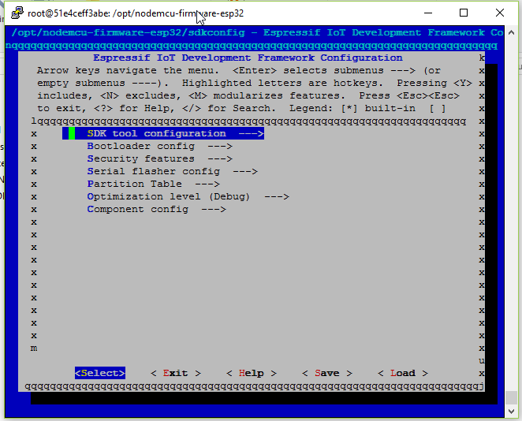
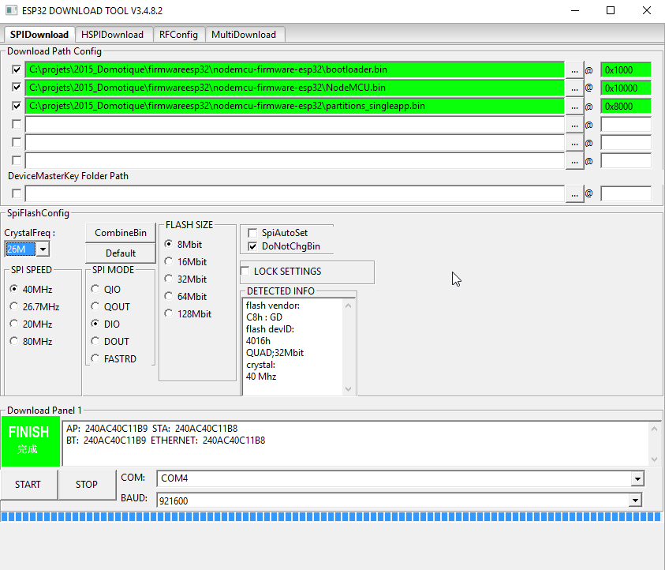

# docker-nodemcu-esp32-build

This project permis to build the **ESP32** branch from NodeMCU firmware, to be able to use lua as programming language for ESP32

This image save time for direct build without having to setup the build environment.

## Build the image

Have a docker host, 

`docker build -t nodemcu_build .`

## How To use the image using interactive configuration

the image aimed to choose the wished configuration and build the firmware, the result are 3 bin files that can be downloaded to the ESP32

run the image

	docker run -ti -v `pwd`/build:/opt/nodemcu-firmware-esp32/build nodemcu_build make
this will present the menuconfig :

choose then the configuration and exit will build the firmware, compiline the result in the "build" directory

## Flashing the firmware from Windows, using ESP32

once compiled, you can take the 3 bin files from the build folder and flashthem at the proper addresses :

